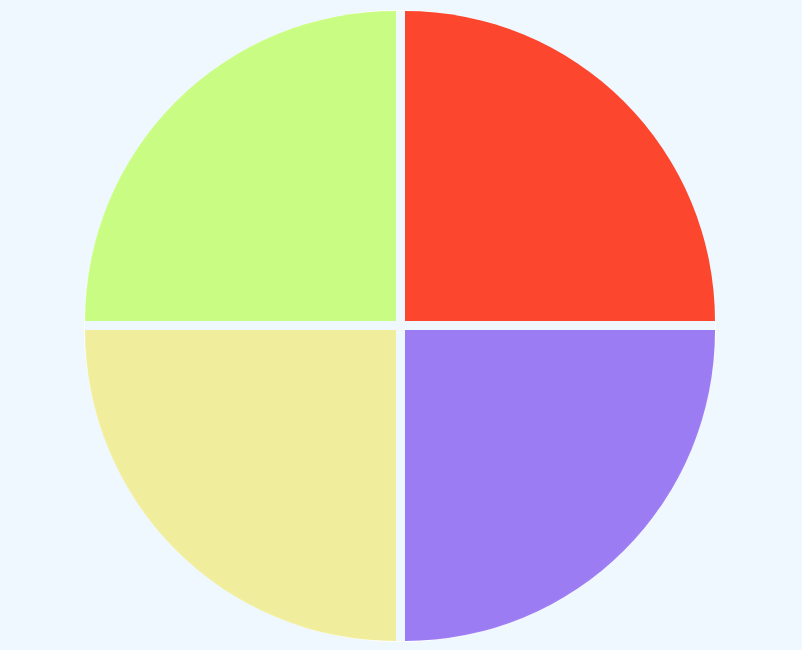

# Criando Jogo Genius

A proposta desse exercício era construir um clone do jogo genius, onde você deve apertar na mesma ordem as cores apresentadas.
Na implementação original, o resultado possuia erros na forma como as cores são apresentadas para o jogador, algo que foi resolvido nesta implementação.

