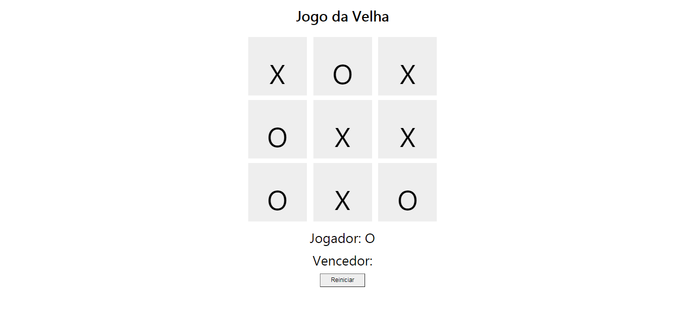
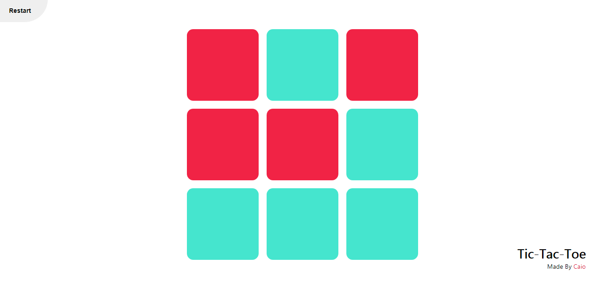

# Jogo da Velha (Tic Tac Toe)

Aqui recriei o clássico Jogo da velha, com um método diferente para calcular quem ganhou.
Segue algumas imagens do projeto:

## Alguns Comentários: 
 - O código original funciona, mas a quantidade absurda de ifs para verificar se há vencedor me incomodou tanto que decidi ir por outro método. Este método está implementado em **main.js:** _checkWin()_
 - Ao invés de criar todas as divs no html, decidi ter uma espécie de gerador. Mas não foquei em fazer ele funcionar, talvez eu reveja este ponto, mas qual seria o ponto de ter um jogo da velha com n casas?