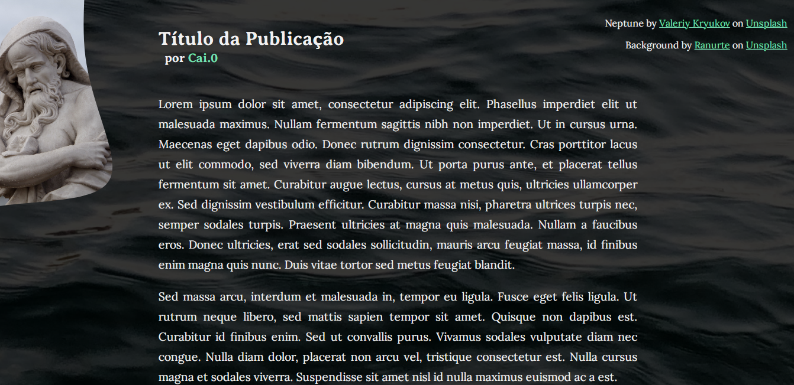

# Introdução a criação de Websites com HTML5 e CSS3

Neste repositório você irá encontrar o resultado final da proposta de exercício, que é uma página em HTML estilizada. As Imagens usadas foram creditadas no canto superior da página

## Nota:

Esta aplicação foi feita em 1 dia sem muito esforço na parte responsiva do projeto. Ela foi feita em uma tela **1366x768**.

### **Screenshots:**
