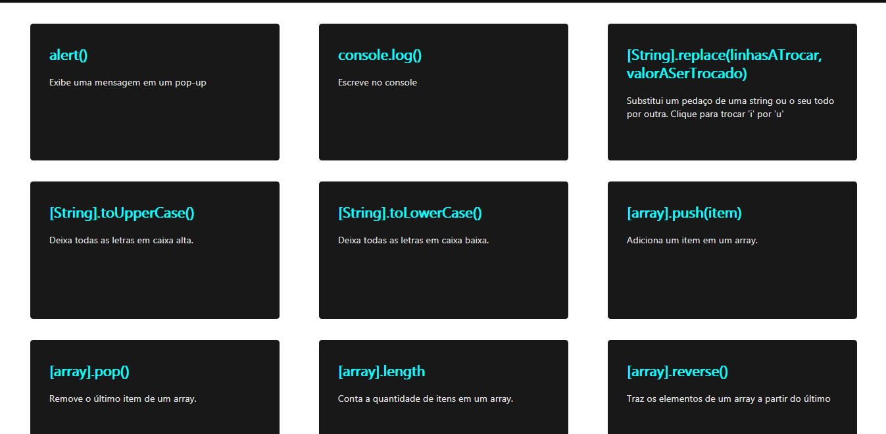

# Programação para Internet com Javascript
Este projeto cria cards com informações guardadas em um array.



```Javascript
let actions = [
    {
        name: "Nome no card",
        desc: "Decrição do card",
        action: (e) => {
            //Código que será executado quando o usuário clicar sobre o card
        }
    },
    {
        name: "Nome do card",
        //...
    }
    //E por aí vai...
]
```